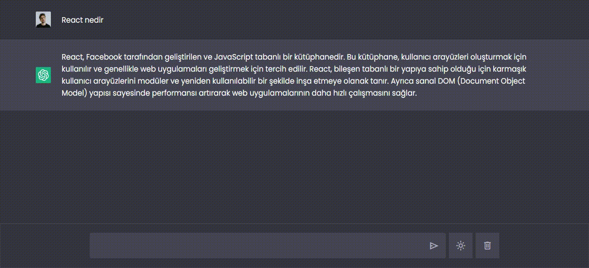

# JsChatGPTClone

-Html ve Css ile sayfa tasarımı yapıldı

-Js ile elementler main.js ye alındı.

-OpenAI api ye fetch ile istek gönderildi ve gelen cevap sohbet olarak yazdırıldı

# JsChatGPTClone
# JsChatGPTClone
# JsChatGPTCloneProje
# JsChatGPTCloneProje
# JsChatGPTCloneProje
# JsProChatGPT
# JsProChatGPT
# JsChatGPTProjesi
